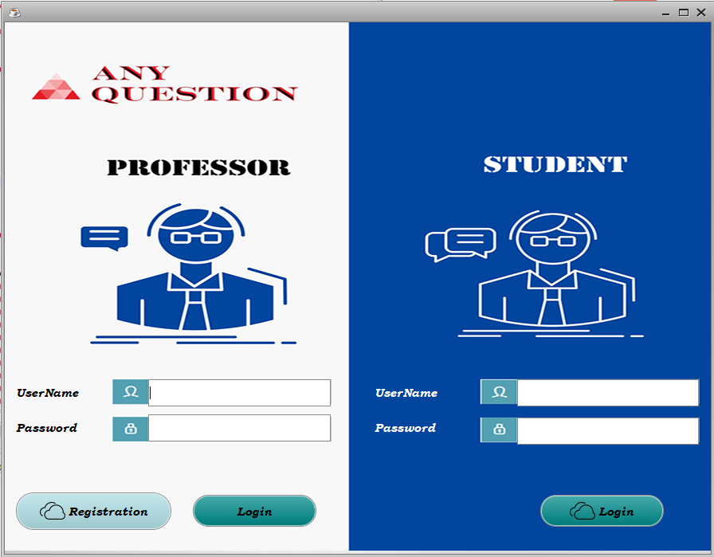
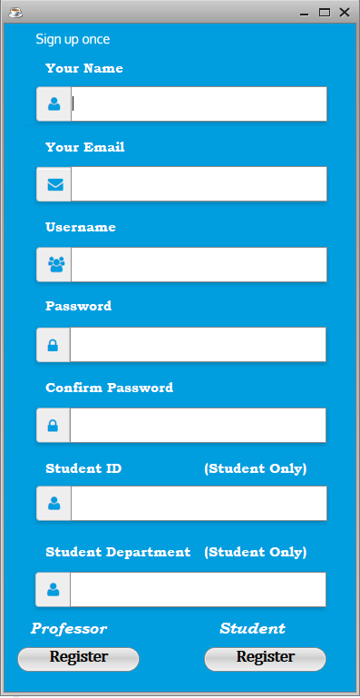
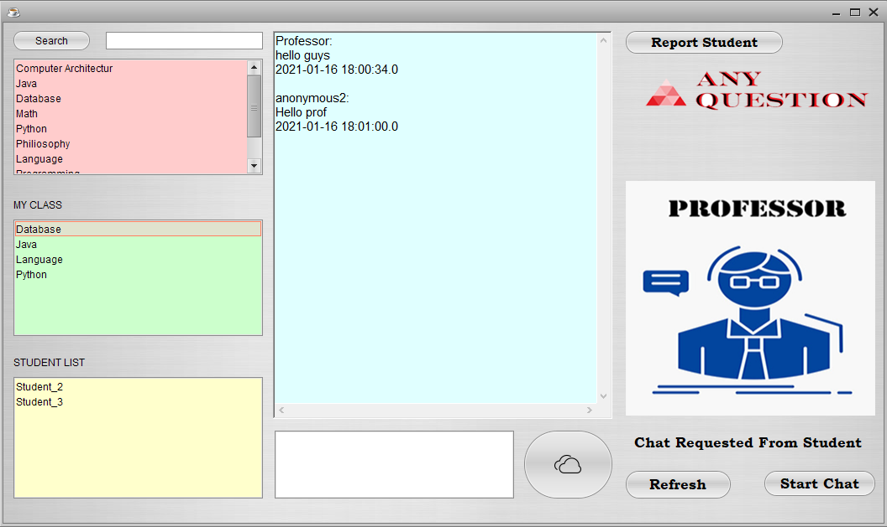
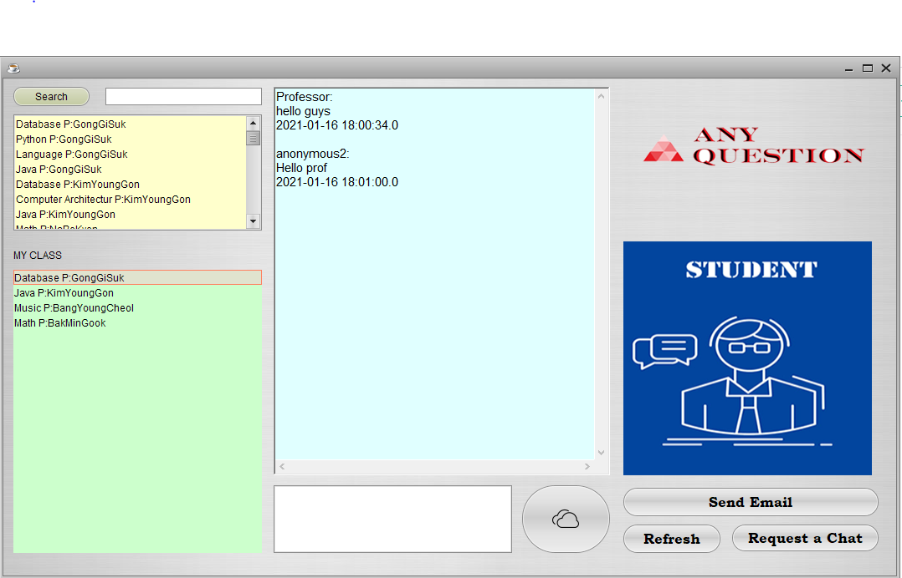
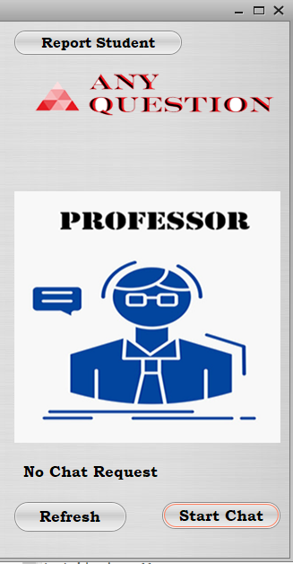
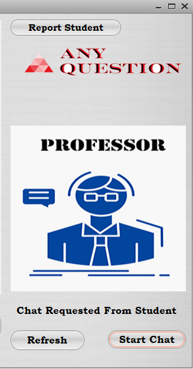
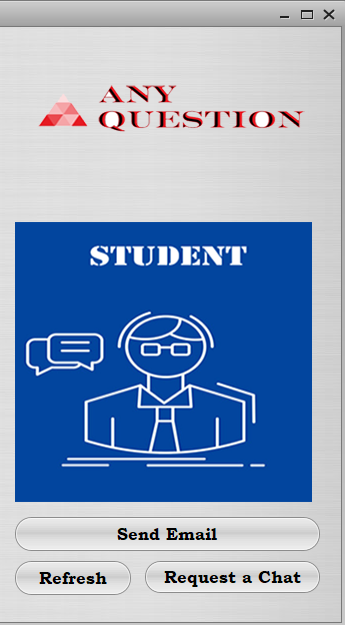
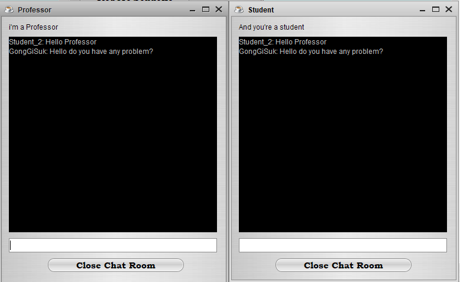
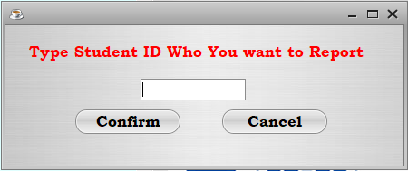
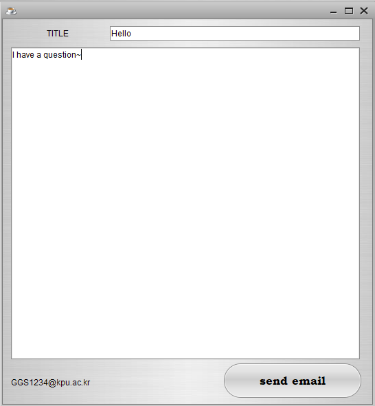

# any_question_java_project
# 익명으로 교수와 학생 간의 커뮤니케이션을 나눌 수 있는 어플리케이션
#### 자바 UI를 이용했으며 JDBC와의 연동을 통한 응용 프로젝트

교수님들이 많이 질문할 것을 요청하는 것에 비해서 학생들의 질문수는 현저히 떨어지고 있다. 학생들간에 눈치를 보기도 하고 질문의 수준이 낮다고 생각하여 안 하는 경우도 많다. 또한 교수님한테 직접 말하는 게 부담스러워서 하지 않는 경우도 있는데 이 ‘Any Question’ 메신져는 그러한 문제들을 해결해 줄 수 있는 솔루션이다. 교수님은 자신의 이름을 공개하나 학생은 자신들의 이름을 공개하지 않은 상태에서 자기가 듣고 있는 수업의 교수님에게 질문이 가능하다. 그럼으로써 활발한 질문과 의사소통이 가능해진다.

# 메신져 이름 : 'Any Question'

## 로그인 창
**교수님 로그인과 학생 로그인이 같이 있으며 각각 해당되는 아이디와 비밀번호를 입력하고 로그인 한다**

##회원가입 창
**회원가입에 필요한 정보 입력**
**각종 에러 처리 및 정보 입력시 무결성 검사와 유일성 검사를 진행함**

## 교수 창 및 본인 지도 과목 학생들에게 공지
**자신이 가르치는 학생들에게 공지를 할 수가 있다
**좌측 상단에서는 자신이 가르치고 있는 과목을 추가할 수 있다
**좌측 하단에는 자신이 가르치는 과목을 볼 수 있다
**좌측 하단에 자신이 가르치는 과목 중 하나를 클릭하면 그 과목을 수강하는 익명의 학생들(숫자로 구분)의 리스트를 볼 수 있다

## 학생 창 및 본인 수강 과목 리스트 및 교수님께 질문
**좌측 상단에는 자신이 수강하고자 하는 과목과 교수를 고를 수 있다
**그렇게 추가된 과목은 좌측 하단에서 확인이 가능하며 클릭할 경우 해당되는 교수님의 공지나 내가 질문할 수 있게 된다

## 교수님과의 1:1 채팅 신청 (교수 창: 채팅 신청 없음)
**어떠한 학생도 채팅 신청을 하지 않았을 때의 상태

## 교수님과의 1:1 채팅 신청 (교수 창: 채팅 신청 있음)
**어떠한 학생의 채팅 요청 신청 시 상태

## 학생이 교수님과의 1:1 채팅 신청
**교수님에게 채팅을 신청할 수 있음

## 교수님과 학생간의 1:1 채팅
**교수님과 학생은 1:1로 채팅이 가능
**학생은 익명이다

## 교수님의 학생 신고 기능
**아무리 익명이라도 불량한 학생이나 막말하는 학생을 방지하기 위한 기능
**학생의 고유 번호로 신고시 관리자가 대화내용을 보고 개인 신상을 알려줄 수 있음

## 교수님께 이메일 보내는 기능
**교수님께 따로 이메일을 보낼 수 있는 기능
**실제로 교수님이 회원가입 했을 때 입력했던 이메일로 이메일이 감
**이메일 API 

